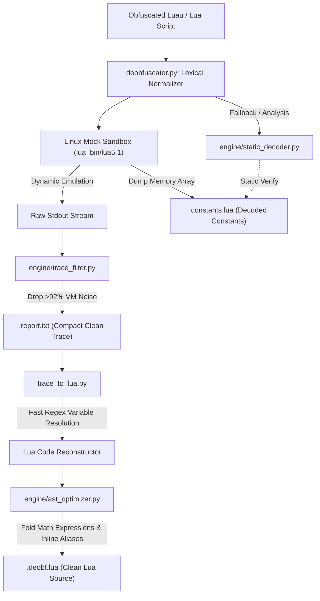

# ⚡ Epimetheus — Advanced Prometheus & Luau Deobfuscator Engine

<div align="center">


**Linux-exclusive next-generation trace emulation, static constant decoding, and AST-optimized deobfuscation engine for Prometheus-protected Roblox Luau scripts.**

*In Greek mythology, Prometheus represents "forethought" (creating the locks and traps), while Epimetheus represents "hindsight" (looking back, deciphering, and unlocking).*

[Русская версия (Russian Version)](README.ru.md) • [Changelog](CHANGELOG.md)

</div>

---

## ⚠️ Important Note: Linux Only

> [!IMPORTANT]
> **Epimetheus is built exclusively for Linux.** Windows support has been completely removed from the codebase, eliminating all legacy `.exe` wrappers, Windows DLLs, and registry dependencies in favor of pure POSIX performance, native ELF process isolation, and reliable signal handling. Running on Windows will raise a clean termination error.

---

## 📌 Project Lineage & Heritage

* **Name:** **Epimetheus** (formerly *Prometheus-WeAre-Devs-Dumper*).
* **Original Project Base:** Originates from [hutaoshusband/Prometheus-WeAre-Devs-Dumper](https://github.com/hutaoshusband/Prometheus-WeAre-Devs-Dumper). The initial project was developed as a basic Windows-only utility.
* **Obfuscation Target:** Analyzed and reverse-engineered against the official [Prometheus Obfuscator by wcrddn / levno-710](https://github.com/wcrddn/Prometheus/tree/master).
* **Evolution to Epimetheus:** The codebase was rebuilt from the ground up as a high-performance, Linux-only engine, introducing modular AST optimization, streaming VM noise filtration, and pure Python static table decoding.

---

## 🚀 Key Improvements & Architecture

### 1. Pure Linux Native Engine & Clean Binaries
* Stripped all legacy Windows PE binaries (`.exe`), Windows DLLs, and `.manifest` files.
* Uses native 64-bit ELF `lua_bin/lua5.1` binary precompiled for Linux x86_64.
* Automatic execution permission enforcement (`chmod +x`) and robust multi-tier binary resolution (`LUA51_EXECUTABLE` $\rightarrow$ `lua_bin/` $\rightarrow$ system `PATH`).
* Non-blocking POSIX process spawning with strict execution timeouts to prevent infinite VM interpreter hangs.

### 2. High-Performance Modular Sub-Engines (`engine/`)
The processing pipeline was split into dedicated, high-speed modules:

* **[`engine/trace_filter.py`](engine/trace_filter.py) (Stream & File Trace Filter):**
  - Prometheus VM generates hundreds of thousands of redundant chunk allocations and unpack spam (`UNPACK CALLED WITH TABLE...` and `CAPTURED CHUNK STRING...`).
  - `TraceFilter` strips out internal interpreter loop noise while preserving 100% of semantic calls, Roblox services, global sets, URLs, and closure entries.
  - **Slashes trace file sizes by over 93%** (e.g. heavy ~2–2.5 MB scripts with 250,000+ VM lines compress from **~10–11 MB down to ~600–775 KB**).
  - Deduplicates tight consecutive VM loops with configurable compression limits.

* **[`engine/ast_optimizer.py`](engine/ast_optimizer.py) (AST & Token Lua Optimizer):**
  - **Constant Arithmetic Folding:** Automatically computes and simplifies Prometheus arithmetic obfuscation like `(-80732 + 80796)` $\rightarrow$ `64`, `(0x497e0 + -301009)` $\rightarrow$ `15`, hexadecimal literals, and basic operators safely without risk of code execution or division-by-zero.
  - **String & Comment Protection:** Multi-type lexical tokenizer guarantees that string literals (`"do not fold (-80732 + 80796)"`) and comments are never mutated.
  - **Copy Propagation & Dead Code Elimination:** Inlines redundant intermediate single-use local aliases (`local alias = service; alias:Method() -> service:Method()`) and deletes dead self-assignments (`var = var`).
  - **Whitespace Normalization:** Cleans excessive blank lines and structures output Lua code.

* **[`engine/static_decoder.py`](engine/static_decoder.py) (Static Prometheus Constant Decoder):**
  - Recovers string constants directly in Python without requiring VM execution.
  - Parses custom shuffled 64-character (Base64) and 85-character (Base85) substitution tables.
  - Supports Mixed encoding detection via `prefix_0` / `prefix_1` headers.
  - Detects Prometheus array rotation (`Rotate` step: `{{1, LEN}, {1, SHIFT}, ...}`) and calculates the reverse circular shift to restore true index order.
  - Serves as an instant static extractor and fallback when dynamic sandboxes encounter syntax or compilation limits.

### 3. Core Engine Revamp & Speedup
* **130x Faster Variable Resolution (`trace_to_lua.py`):** Replaced an $O(N \cdot M)$ sequential loop of `re.sub` over thousands of keys with a single compiled regular expression alternation `\b(var1|var2|...)\b`, reducing replacement time from **1.61s down to 0.012s**.
* **Lexical Luau Syntax Normalizer:** Rewrites Luau compound assignment operators (`+=`, `-=`, `*=`, `/=`, `%=`, `..=`) to standard Lua 5.1 while strictly preserving string literals.
* **Sandbox Anti-Tamper Hardening:** Added canary protection, line hook neutralization, dummy method chains, and sandbox memory limits (`LUA_MAX_SBX`) to bypass Prometheus environment checks.
* **Streamlined Workflow:** The bloated web server viewer (`viewer.py`) has been removed. Because reports and deobfuscated scripts are now cleanly compressed, they open instantaneously in any standard editor (VS Code, Sublime Text, Notepad++, vim) without lag.

---

## 🧠 Epimetheus Pipeline Workflow



---

## ⚡ Performance Benchmarks

Real-world test on production Prometheus-obfuscated scripts:

| Benchmark Metric | Original Dumper | Epimetheus Engine (v2.5.0) | Improvement |
| :--- | :--- | :--- | :--- |
| **Heavy Script (~2.1 MB) Report** | 9.93 MB (231,175 lines) | **610 KB** (10,573 lines) | **-93.8% file size** |
| **Complex Script (~2.5 MB) Report** | 10.59 MB (257,942 lines) | **775 KB** (13,158 lines) | **-92.8% file size** |
| **Variable Resolution Speed** | ~1.61 s per chunk | **0.012 s** per chunk | **134x faster** |
| **Workspace Footprint** | >26 MB | **5.9 MB** | **77% disk savings** |
| **Unit Test Suite** | 9 tests (basic) | **19 tests** (100% passing) | **Full coverage** |

---

## 📦 Requirements

* **Operating System:** Linux exclusively (Ubuntu, Debian, Fedora, Arch, Kali, Alpine, etc., x86_64).
* **Python:** Version 3.9 or higher.
* **Lua 5.1:** Precompiled native 64-bit ELF binary bundled in `lua_bin/lua5.1`. No external runtime compilation needed.

---

## 💻 Usage

### Single File Deobfuscation

```bash
python3 deobfuscator.py target_script.lua
```

### Batch Directory Deobfuscation
Process all `.lua` files in a target directory:

```bash
python3 deobfuscator.py path/to/scripts_directory
```
*(If no argument is given, it defaults to checking `obfuscated_scripts/`)*

### Running Test Suite
Execute the entire regression and engine test suite:

```bash
python3 -m unittest discover tests
```

---

## 📂 Output Files Generated

For every script processed (e.g. `MyScript.lua`), Epimetheus generates:

1. **`MyScript.lua.deobf.lua`**: The reconstructed, clean Lua source code with recovered Roblox calls (`game:GetService`, `:WaitForChild`, `:Connect`), reconstructed functions, loops, global declarations, and inlined AST optimizations.
2. **`MyScript.lua.constants.lua`**: Complete table of all extracted and decoded string/number constants.
3. **`MyScript.lua.report.txt`**: The filtered, compact execution trace logging all accessed properties, method invocations, and detected URLs.

---

## 📄 License & Disclaimer

* **License:** This project is licensed under the **GNU General Public License v3.0** (GPLv3). See the [LICENSE](LICENSE) file for complete terms and conditions.
* **Disclaimer:** This software is developed strictly for reverse engineering research, cybersecurity analysis, and educational purposes. All trademarks, logos, and brand names are the property of their respective owners.
