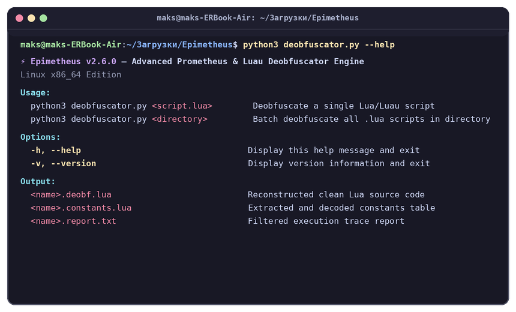
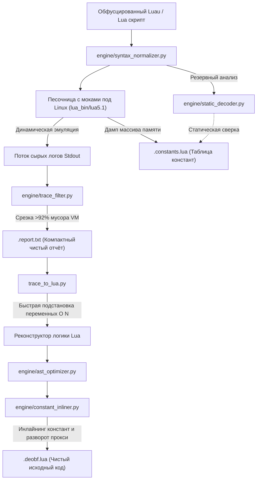

# ⚡ Epimetheus — Продвинутый Движок Деобфускации Prometheus и Luau (Только Linux)

<div align="center">


**Специализированный Linux-движок нового поколения для эмуляции трассировки, статического декодирования констант и AST-оптимизации обфусцированных скриптов Roblox Luau.**

*В греческой мифологии Прометей олицетворяет «предвидение» (создание замков и ловушек обфускации), а Эпиметей — «осознание задним числом» (взгляд назад, раскрытие и расшифровка).*

[English Version](README.md) • [История изменений (Changelog)](CHANGELOG.md)

<br/>



</div>

---

## ⚠️ Важное примечание: Только для Linux

> [!IMPORTANT]
> **Программа Epimetheus разработана исключительно для Linux.** Движок строго проверяет платформу хоста (`sys.platform.startswith("linux")`). Запуск на сторонних операционных системах (Windows, macOS / Darwin, BSD) намеренно блокируется для обеспечения строгой семантики процессов POSIX, нативного исполнения 64-битных ELF-файлов (`lua_bin/lua5.1`) и надёжной обработки сигналов таймаута.

---

## 📌 Происхождение проекта и ссылки

* **Название проекта:** **Epimetheus** (ранее *Prometheus-WeAre-Devs-Dumper*).
* **Базовый проект:** Переработан и развит на основе [hutaoshusband/Prometheus-WeAre-Devs-Dumper](https://github.com/hutaoshusband/Prometheus-WeAre-Devs-Dumper). Изначальный форк разрабатывался как простая утилита исключительно под Windows.
* **Сурсы обфускатора Prometheus:** Изучен и исследован по официальному исходному коду [Prometheus Obfuscator от levno-710 (версия v0.2.11.1)](https://github.com/prometheus-lua/Prometheus).
* **Атрибуция (Attribution):** Based on Prometheus by Elias Oelschner, https://github.com/prometheus-lua/Prometheus
* **Эволюция в Epimetheus:** Код был фундаментально переработан в высокопроизводительный Linux-движок с модульной AST-оптимизацией, потоковой фильтрацией логов VM, чистым статическим декодером на Python и лексической нормализацией Luau.

---

## 🚀 Что было сделано, улучшено и пересобрано

### 1. Нативная среда Linux и очистка от Windows-мусора
* Из репозитория полностью удалены все Windows PE-бинарники (`.exe`), динамические библиотеки (`.dll`) и манифесты (`.manifest`).
* Используется нативный 64-битный исполняемый ELF-бинарник `lua_bin/lua5.1`, скомпилированный под Linux x86_64.
* Реализована автоматическая выдача прав на исполнение (`chmod +x`) и многоуровневый поиск интерпретатора (`LUA51_EXECUTABLE` $\rightarrow$ локальный `lua_bin/` $\rightarrow$ системный `PATH`).
* Управление процессами переведено на надёжный неблокирующий POSIX-интерфейс с контролем таймаутов от зависаний.

### 2. Новые вспомогательные модули движка (`engine/`)
Вся тяжелая работа вынесена в специализированный модульный пакет:

* **[`engine/syntax_normalizer.py`](engine/syntax_normalizer.py) (Нормализатор синтаксиса Luau):**
  - **Преобразование составных присваиваний:** Автоматически разворачивает составные операторы Luau (`+=`, `-=`, `*=`, `/=`, `%=`, `^=`, `..=`) в стандартный синтаксис Lua 5.1 (например, `x += 5` $\rightarrow$ `x = x + 5`) с гарантией неприкосновенности строковых литералов, вложенных скобок и комментариев.
  - **Комплексная очистка аннотаций типов Luau:** Удаляет объявления алиасов типов (`type Foo = ...`, `export type Bar = ...`), аннотации параметров и возвращаемых типов функций (`function foo(a: any, b: number): boolean` $\rightarrow$ `function foo(a, b)`), а также типизированные локальные переменные (`local x: number = 1` $\rightarrow$ `local x = 1`, `local z: Vector3` $\rightarrow$ `local z`), обеспечивая полную совместимость со стандартным парсером Lua 5.1.

* **[`engine/constant_inliner.py`](engine/constant_inliner.py) (Инлайнер констант и распаковка обёрток):**
  - **Инлайнинг функций-обёрток ConstantArray:** Вычисляет и подставляет статические обращения к массиву констант через функции-обёртки (`wrapper(a) return ARR[a + offset] end`), напрямую вставляя константы на места вызовов `wrapper(...)` в деобфусцированном коде.
  - **Распаковка проксированных переменных:** Распознаёт обфускацию локальных переменных через метатаблицы (`ProxifyLocals.lua`) и восстанавливает их в прямые локальные объявления.

* **[`engine/trace_filter.py`](engine/trace_filter.py) (Потоковый фильтр и сжатие трассировки):**
  - Виртуальная машина Prometheus генерирует сотни тысяч мусорных строк аллокаций памяти (`UNPACK CALLED WITH TABLE...` и `CAPTURED CHUNK STRING...`).
  - `TraceFilter` на лету отсекает шум интерпретатора, сохраняя 100% смысловых операций: вызовы сервисов Roblox (`game:GetService`), методов, глобальных переменных, URL и точек входа в замыкания.
  - **Сжимает размер отчётов более чем на 92–93%** (например, для тяжелых скриптов размером 2–2.5 МБ с более чем 250 000 строк логов отчёт сжимается с **~10–11 МБ до ~600–775 КБ**).
  - Сжимает многократные повторяющиеся циклы VM с настраиваемым порогом дубликатов.

* **[`engine/ast_optimizer.py`](engine/ast_optimizer.py) (Оптимизатор AST и токенов Lua):**
  - **Свёртка константных выражений (Constant Folding):** Безопасно вычисляет обфусцированную арифметику Prometheus (например, `(-80732 + 80796)` $\rightarrow$ `64`, `(0x497e0 + -301009)` $\rightarrow$ `15`, научную экспоненциальную нотацию `1e5`, операции возведения в степень `2 ^ 8`, шестнадцатеричные и двоичные числа с базовыми операторами) без риска выполнения вредоносного кода или деления на ноль.
  - **Свёртка разбитых строк (Reversal of SplitStrings):** Автоматически сшивает фрагменты строк, разбитые шагом `SplitStrings.lua` (например, `"game:Get" .. "Service"` $\rightarrow$ `"game:GetService"`), а также статические вызовы `table.concat` в единые читаемые строки.
  - **Устранение мёртвых проверок водяного знака:** Распознаёт и вырезает фиктивные условные блоки `WatermarkCheck.lua`.
  - **Защита строк и комментариев:** Лексический токенизатор гарантирует, что строковые литералы (`"не трогать (-80732 + 80796)"`) и комментарии никогда не повреждаются.
  - **Copy Propagation и чистка мёртвого кода:** Устраняет лишние промежуточные переменные-алиасы (`local alias = service; alias:Method() -> service:Method()`) и удаляет бессмысленные самоприсваивания (`var = var`).
  - **Нормализация разметки:** Устраняет избыточные пустые строки и форматирует код.

* **[`engine/static_decoder.py`](engine/static_decoder.py) (Статический декодер констант):**
  - **Потоковый PRNG-дешифратор:** Реализует математически точный обратный алгоритм потокового шифра `EncryptStrings.lua`, позволяя расшифровывать зашифрованные строки напрямую на Python без запуска VM.
  - Восстанавливает строковые константы напрямую на Python без необходимости запускать виртуальную машину Lua.
  - Распознаёт перемешанные таблицы алфавитов Base64 (64 символа) и Base85 (85 символов), динамически вычисляя значения символов.
  - Поддерживает смешанное кодирование (Mixed) по префиксам `prefix_0` / `prefix_1`.
  - Распознаёт шаг циклического сдвига (`Rotate`: `{{1, LEN}, {1, SHIFT}, ...}`) с поддержкой мутированных арифметических и hex-выражений, обращая сдвиг для восстановления оригинальных индексов.
  - Работает автономно и служит надёжным резервным анализатором констант.

### 3. Оптимизация ядра и устранение узких мест
* **Ускорение разрешения переменных в 130+ раз (`trace_to_lua.py`):** Квадратичный цикл `re.sub` по тысячам ключей заменён на единый скомпилированный шаблон `\b(var1|var2|...)\b`, что снизило время подстановки со **1.61 с до 0.012 с**.
* **Усиленная изоляция песочницы Lua:** Опасные функции хоста (`io`, `package`, `os.execute`, `os.remove`, `os.rename`, `os.exit`, `dofile`, `loadfile`) полностью вычищены как из `MockEnv`, так и из корневого окружения интерпретатора. Доступ предоставлен только к изолированному `safe_os` (`clock`, `time`, `difftime`, `date`), а изоляция чанка зафиксирована через `setfenv(1, MockEnv)`.
* **Обход защит Anti-Tamper:** Нейтрализация проверок окружения (`debug.sethook`, канареечные проверки, цепочки вызовов фиктивных объектов).
* **Удаление вьюера:** Тяжелый веб-сервер (`viewer.py`) полностью удалён из проекта. Так как отчёты и деобфусцированные файлы теперь компактны, они мгновенно открываются в любых редакторах (VS Code, Sublime Text, Notepad++, vim) без лагов.

---

## 🧠 Схема работы конвейера Epimetheus



---

## ⚡ Сравнение производительности

Результаты тестирования на реальных скриптах Прометея:

| Параметр | Исходный дампер | Движок Epimetheus (v2.6.0) | Прирост |
| :--- | :--- | :--- | :--- |
| **Отчёт тяжёлого скрипта (~2.1 МБ)** | 9.93 МБ (231 175 строк) | **610 КБ** (10 573 строки) | **-93.8% размера** |
| **Отчёт сложного скрипта (~2.5 МБ)** | 10.59 МБ (257 942 строки) | **775 КБ** (13 158 строк) | **-92.8% размера** |
| **Скорость подстановки переменных** | ~1.61 сек на блок | **0.012 сек** на блок | **В 134 раза быстрее** |
| **Объём рабочей директории** | >26 МБ | **5.9 МБ** | **Экономия 77% диска** |
| **Набор тестов** | 9 тестов (базовые) | **31 модульный тест** (27 активных, 4 локальных) | **Комплексный набор тестов** |

---

## 📦 Системные требования

* **Операционная система:** Исключительно Linux (Ubuntu, Debian, Fedora, Arch, Kali, Alpine и др., архитектура x86_64).
* **Python:** Версия 3.9 или выше.
* **Lua 5.1:** Поставляется в комплекте в папке `lua_bin/lua5.1` (нативный 64-битный исполняемый ELF-файл). Дополнительно компилировать ничего не требуется.

---

## 🛠️ Установка и первый запуск

1. **Клонируйте репозиторий:**
   ```bash
   git clone https://github.com/NoName2323-wq/Epimetheus.git
   cd Epimetheus
   ```

2. **Убедитесь в наличии прав на выполнение:**
   ```bash
   chmod +x deobfuscator.py format_lua.py lua_bin/lua5.1
   ```

3. **Проверьте корректность установки:**
   ```bash
   ./deobfuscator.py --version
   # или запустите набор тестов:
   python3 -m unittest discover tests
   ```

---

## 💻 Использование

### Деобфускация одного файла

```bash
python3 deobfuscator.py target_script.lua
```

### Пакетная деобфускация директории
Обработать все `.lua` файлы в указанной папке:

```bash
python3 deobfuscator.py путь/к/папке_со_скриптами
```
*(По умолчанию при запуске без аргументов проверяется папка `obfuscated_scripts/`)*

### Запуск тестов
Запуск полного набора модульных и регрессионных тестов:

```bash
python3 -m unittest discover tests
```

---

## 📂 Генерируемые файлы

Для каждого скрипта (например, `Script.lua`) Epimetheus создаёт:

1. **`Script.lua.deobf.lua`**: Реконструированный чистый код на Lua со всеми восстановленными вызовами Roblox (`game:GetService`, `:WaitForChild`, `:Connect`), глобалами, функциями и оптимизированными AST-выражениями.
2. **`Script.lua.constants.lua`**: Полная таблица извлечённых и расшифрованных строковых/числовых констант.
3. **`Script.lua.report.txt`**: Сжатый отчёт трассировки со всеми зарегистрированными обращениями, методами и URL.

---

## 📄 Лицензия и авторские права

* **Лицензия:** Проект распространяется под свободной лицензией **GNU General Public License v3.0** (GPLv3). Подробные условия и права использования приведены в файле [LICENSE](LICENSE).
* **Атрибуция (Attribution):** Based on Prometheus by Elias Oelschner, https://github.com/prometheus-lua/Prometheus
* **Дисклеймер:** Программное обеспечение разработано исключительно в исследовательских и образовательных целях для анализа защиты и реверс-инжиниринга. Все товарные знаки являются собственностью их владельцев.
